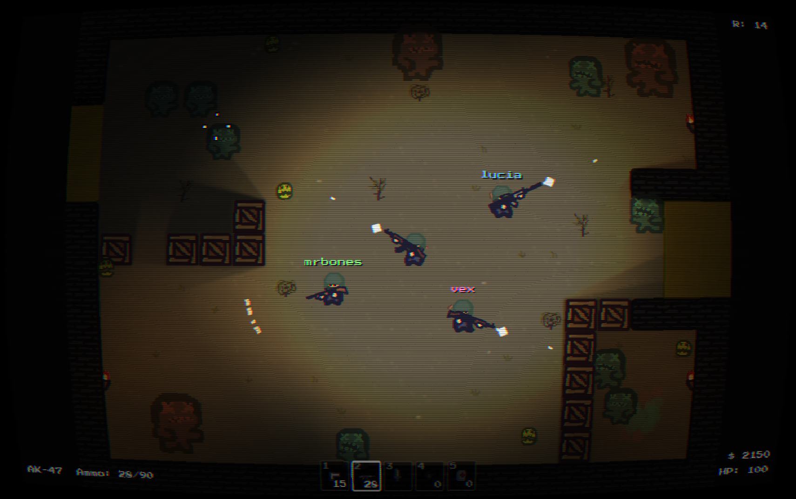
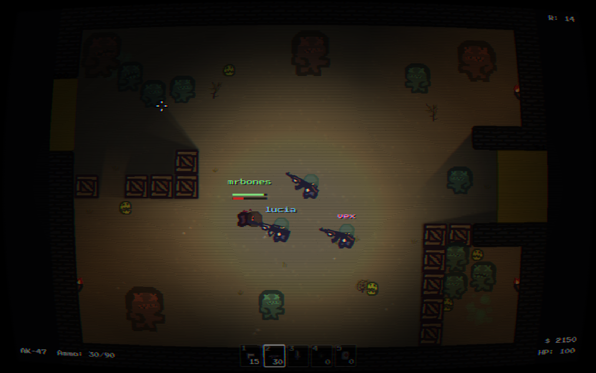

# Zombie Chamber

A top-down zombie wave shooter — the CoD Zombies loop, seen from above.
Kill for cash, spend it on wall guns, locked doors and the mystery box, and
survive as long as the horde lets you. Up to 4 players over LAN.

Made in [LÖVE](https://love2d.org) (Lua). Playable in the browser or as a
desktop download: **[coffeebreak1.itch.io/zombiechamber](https://coffeebreak1.itch.io/zombiechamber)**



## Play

Install [LÖVE 11.5](https://love2d.org/), then from the project folder:

```sh
love .
```

### Controls

| Key | Action |
|---|---|
| `WASD` | Move |
| `Shift` | Sprint (can't shoot while sprinting) |
| Mouse | Aim / shoot |
| `R` | Reload |
| `Q` | Quick knife |
| `1`–`5` / wheel | Swap item |
| `E` | Buy / interact / hold to revive |
| `G` | Drop gun |
| `Esc` | Pause |
| `V` (hold) | Voice chat |
| `Tab` (hold) | Scoreboard |
| `T` | Text chat |
| `U` | Reload `tune.lua` and restart the run |

Every key is rebindable in Options.

## What's in it

- **4-player LAN co-op** — one world, per-player cash, voice chat, drop in mid-run
- **Downed & revive** — bleed out on the floor until a teammate drags you up
- 4 guns + knife, grenades and molotovs
- Mystery box with live odds, wall-buys, paid doors, pushable crates
- 7 power-ups: Nuke, Insta-Kill, Max Ammo, Fire Sale, Double Points, Freeze, Carpenter
- 3 zombie types, endless waves, a NIGHTMARE wave every 5th
- Dynamic lighting, positional audio, CRT filter
- English, Português, Español



## Tuning

**Every gameplay number lives in [`tune.lua`](tune.lua)** — damage, prices,
wave sizes, reload times, walk speeds. Edit it in any text editor and press
`U` in game to reload it and restart the run. Nothing gameplay-related is
hardcoded anywhere else.

## Layout

```
main.lua      entry point and command-line modes
conf.lua      LÖVE window config
tune.lua      all gameplay numbers
core/         world, map, waves, input, audio, lighting, save, i18n
entities/     player, enemy, bullet, chest, door, crate, powerup, ...
states/       menu, playing, paused, lobby, options, gameover, ...
ui/           HUD, hotbar, scoreboard, chat, crosshair, theme
net/          LAN co-op: transport, protocol, replication, discovery, voice
maps/         level definitions
tools/        build and test helper scripts
```

## Development

```sh
love . selftest        # ~190 scripted checks; exits nonzero on failure
bash tools/lantest.sh  # two-process LAN co-op run
love . autotest        # screenshot a run to the LÖVE save dir, then quit
love . fpsprobe        # framerate, draw calls, canvas sizes
```

`selftest` is the regression gate — it drives a real world through the input
struct, so gameplay, co-op rules and the wire format are all covered without a
human at the controls. Run it before committing.

Screenshots of individual screens: `love . autotest_menu`, `autotest_score`,
`autotest_lobby`, `autotest_downed`, and friends. Promo shots for the itch
page: `bash tools/promo.sh`.

## Building

```sh
./build.sh          # dist/ — mac .app, windows .exe, linux .love, all zipped
./deploy.sh desktop # build + push to itch
./deploy.sh web     # browser build, smoke-tested, pushed
```

The web build ships from the `web-release` branch, never from `main` — a
browser tab can't open a UDP socket, so the LAN code must not enter it. Full
procedure in [docs/web-build-plan.md](docs/web-build-plan.md).

## Project docs

- [SPEC.md](SPEC.md) — the design, in detail
- [PLAN.md](PLAN.md) — build order, what's next
- [PROGRESS.md](PROGRESS.md) — what has shipped
- [CHANGELOG.md](CHANGELOG.md) — player-visible changes per release
